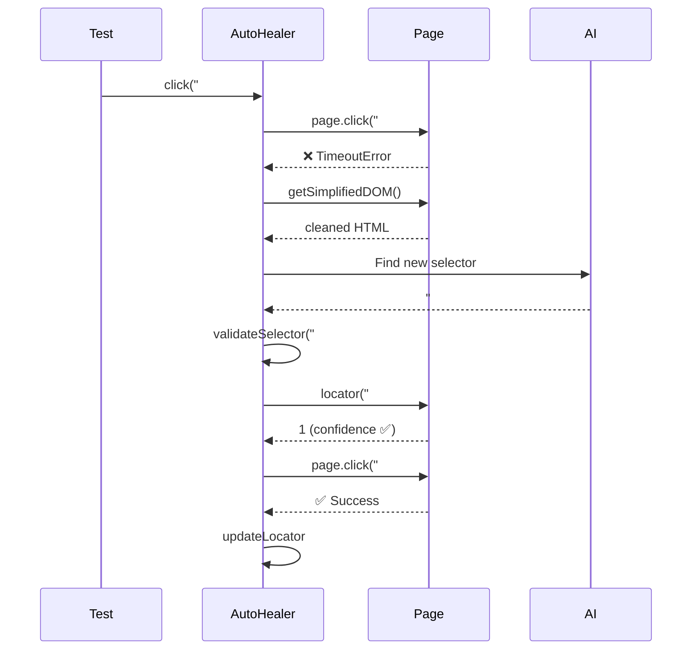

# Self-Healing Playwright Agent 🤖🏥

> A resilient test automation wrapper that uses Generative AI (OpenAI or Google Gemini) to automatically fix broken selectors at runtime.


## ✨ Features

| Feature                     | Description                                                                                                                             |
| --------------------------- | --------------------------------------------------------------------------------------------------------------------------------------- |
| 🔧 **AI Self-Healing**      | Automatically fixes broken selectors using OpenAI or Gemini                                                                             |
| 🔒 **Selector Validation**  | Denylist/allowlist guards reject dangerous or malformed AI-returned selectors                                                           |
| ✅ **Confidence Threshold** | Healed selectors are scored against the live DOM (match uniqueness + strategy) and must resolve to exactly one element before the retry |
| 🔄 **Provider Fallback**    | Automatically switches between Gemini/OpenAI on rate limits                                                                             |
| 🌐 **Multi-Browser**        | Chromium, Chrome, Firefox, Safari, Edge + Mobile devices                                                                                |
| 🌍 **Multi-Environment**    | Dev, Staging, Prod configs with `.env.{env}` files                                                                                      |
| 📊 **Structured Logging**   | Winston logger with console + file output                                                                                               |
| 📄 **Page Object Model**    | Clean POM architecture with proper page flows                                                                                           |
| 🔄 **CI/CD Ready**          | GitHub Actions with retries and HTML reports                                                                                            |

## 🚀 Quick Start

```bash
# Install dependencies
npm install

# Run tests (production environment)
npm run test:prod

# Run the Self-Healing Demo specifically
npm run test:healing-demo

# Run on specific browser
npm run test:firefox
npm run test:webkit
```

## 🌍 Multi-Environment Support

```bash
# Development (visible browser, debug logging)
npm run test:dev

# Staging
npm run test:staging

# Production (headless, minimal logging)
npm run test:prod
```

**Environment files:**

- `.env.dev` - Development configuration
- `.env.staging` - Staging configuration
- `.env.prod` - Production configuration
- `.env.example` - Template with all available options

## 🌐 Cross-Browser Testing

| Project         | Browser/Device |
| --------------- | -------------- |
| `prod`          | Desktop Chrome |
| `chromium`      | Chromium       |
| `chrome`        | Google Chrome  |
| `firefox`       | Firefox        |
| `webkit`        | Safari         |
| `edge`          | Microsoft Edge |
| `mobile-chrome` | Pixel 5        |
| `mobile-safari` | iPhone 12      |
| `tablet`        | iPad (gen 7)   |

```bash
# Run on all 9 browser configurations
npm run test:prod:all-browsers
```

## 🔧 Configuration

### Environment Variables

Create a `.env.prod` file (or copy from `.env.example`):

```bash
# Environment
ENV=prod
BASE_URL=https://books.toscrape.com/

# AI Provider (gemini or openai)
AI_PROVIDER=gemini
GEMINI_API_KEY=your_gemini_key_here
GEMINI_MODEL=gemma-4-31b-it

# Or use OpenAI
OPENAI_API_KEY=sk-your-openai-key
OPENAI_MODEL=gpt-4o

# Logging
LOG_LEVEL=warn

# Test Configuration
TEST_TIMEOUT=120000
HEADLESS=true

# AI Healing (optional — defaults shown)
DOM_SNAPSHOT_CHAR_LIMIT=12000  # Max chars of DOM sent to AI; must be >= 100 (serialiser caps at 15000)
HEALING_FAILURE_MODE=fail      # 'fail' (default) throws when healing cannot produce a usable
                               # selector; 'skip' calls test.skip() instead. Prefer 'fail' — a
                               # skipped test reports green, hiding a healer that never worked.
SELECTOR_QUARANTINE_THRESHOLD=3  # Consecutive post-heal failures before a healed selector is
                                 # rolled back to the value it replaced. Must be >= 1.

# Locator Storage Backend
LOCATOR_STORE=file    # 'file' (default, JSON + lockfile) or 'sqlite' (ACID SQLite)
```

## 🐳 Run with Docker

Run the full test suite in a containerized environment — no local Node.js or Playwright install needed.

### Quick start

```bash
# Copy your env vars
cp .env.example .env   # then fill in GEMINI_API_KEY / OPENAI_API_KEY

# Run unit tests (typecheck → lint → format → Vitest)
docker-compose run --rm unit-tests

# Run E2E tests (headless, prod)
docker-compose run --rm e2e-tests
```

### Build image explicitly

```bash
docker-compose build
```

### View reports

After E2E tests finish, the HTML report is written to `./playwright-report` on the host:

```bash
npx playwright show-report playwright-report
```

### Environment variables

Pass overrides directly without editing `.env`:

```bash
AI_PROVIDER=openai OPENAI_API_KEY=sk-... docker-compose run --rm e2e-tests
```

## Technical Notes

```
src/
├── AutoHealer.ts              # Public healing API (click, fill, hover…) + heal() orchestration
├── ai/
│   ├── AIClientManager.ts     # AI client lifecycle, key rotation, provider failover
│   ├── HealingEngine.ts       # Full heal cycle: DOM → AI → parse → validate → confidence check
│   ├── RetryOrchestrator.ts   # Exponential backoff with jitter for AI retries
│   ├── DOMSerializer.ts       # getSimplifiedDOM() — interactive-element snapshot
│   ├── ResponseParser.ts      # parseAIResponse() — cleans raw AI output
│   ├── SelectorValidator.ts   # Denylist/allowlist guard for AI-returned selectors
│   └── index.ts               # Barrel re-export
├── config/
│   ├── index.ts               # Centralized configuration
│   ├── locators.json          # Persistent selector storage
│   └── metrics.json           # Per-key selector failure/heal metrics
├── pages/
│   ├── BasePage.ts            # Abstract base page
│   ├── BooksHomePage.ts       # Books to Scrape home page; category nav, pagination
│   └── BookDetailPage.ts      # Book detail page; title, price, breadcrumbs
├── reporters/
│   └── HealingReporter.ts     # Merges per-worker healing shards → healing-report.json
└── utils/
    ├── Environment.ts         # Multi-env loader
    ├── Logger.ts              # Winston wrapper
    ├── CircuitBreaker.ts      # Per-provider circuit breaker (opens after 5 failures)
    ├── HealingMetrics.ts      # Per-key selector failure/heal event tracking
    ├── LocatorAdapter.ts      # Pluggable storage: FileAdapter | SQLiteAdapter
    ├── LocatorManager.ts      # Selector persistence (facade over LocatorAdapter) + stability
    │                          #   metrics + rollback of healed selectors that keep failing
    └── SiteHandler.ts         # Overlay dismissal (Strategy pattern)

tests/
├── books-to-scrape.spec.ts    # E2E tests
├── healing-demo.spec.ts       # Self-healing demo tests
├── fixtures/base.ts           # Playwright fixtures
├── benchmark/                 # Healing accuracy benchmark (nightly CI only)
│   └── healing-accuracy.spec.ts
└── unit/                      # Unit tests
    ├── autohealer-core.test.ts
    └── autohealer-error-handling.test.ts
```

## 🔄 CI/CD

**Playwright Tests** (`.github/workflows/playwright.yml`) runs on every push and PR to `main`:

- ✅ Unit tests with code coverage reporting
- ✅ E2E tests on **all 9 browser configurations** (matrix strategy), including Self-Healing tests on every browser
- ✅ HTML report artifacts
- ✅ Automatic retries for flaky tests

**Dependency Audit** (`.github/workflows/audit.yml`) is a separate pipeline running `npm audit --audit-level=high`:

- 🌙 Nightly (06:00 UTC) and on manual `workflow_dispatch`
- 📦 On PRs that change `package.json` or `package-lock.json` — but not on PRs that leave dependencies untouched

Advisories publish on the ecosystem's schedule rather than the project's, so gating every PR on them would turn unrelated branches red. Keeping the audit in its own workflow also means a newly-disclosed CVE surfaces as its own red check, distinct from a genuine test failure.

## 🧬 Architecture — How Self-Healing Works



## 📝 How It Works

```typescript
// AutoHealer intercepts failures and uses AI to recover
async click(selector: string) {
  try {
    await this.page.click(selector);
  } catch (error) {
    // 1. Ask AI for a replacement selector
    const result = await this.heal(selector, error);
    // heal() internally:
    //   a) validateSelector() — denylist/allowlist guards against dangerous patterns
    //   b) scoreSelector() — confidence from match uniqueness + selector strategy
    if (result) {
      // assertUniqueMatch() — healed selector must resolve to exactly 1 element
      await this.page.click(result.selector);
      this.healingEvents.push(event); // accessible via getHealingEvents()
    }
  }
}
```

_Note: If the primary AI Provider (e.g. Gemini) hits a 4xx Rate Limit error, the `AutoHealer` automatically detects the quota failure and falls back to an alternate AI Provider (e.g. OpenAI) if configured!_

### 🧭 Keeping page objects on the healing path

`safeClick()` accepts either a **selector string** or a pre-built Playwright **`Locator`**. Only the string form can heal — a `Locator` has already resolved to an element and carries no selector text for the AI to repair, so `BasePage` clicks it directly and `AutoHealer` never runs.

```typescript
// ❌ Bypasses healing — the Locator is clicked directly
const link = this.page.locator(categoryLink).filter({ hasText: 'Mystery' }).first();
await this.safeClick(link);

// ✅ Heals — and persists the repaired selector, because a bare key round-trips to the store
await this.safeClick('booksToScrape.nextPageButton');

// ✅ Heals — compose from the resolved value when you need an index, chain, or text filter
await this.safeClick(`${this.selectorFor('booksToScrape.bookTitle')} >> nth=${index}`);
```

Two helpers on `BasePage` support this:

| Helper                              | Use for                                                                                                                           |
| ----------------------------------- | --------------------------------------------------------------------------------------------------------------------------------- |
| `selectorFor(key)`                  | Resolve a dot-path key to its current selector **at call time**, so a selector healed earlier in the same run is used immediately |
| `safeWaitForSelector(key, options)` | The read path — waits through `AutoHealer`, so assertions on a title or price heal instead of failing on a stale selector         |

**Persistence caveat:** a repaired selector is written back to the store only when a **bare key** is passed. A composed string (`… >> nth=2`) still heals, but is not persisted — the healed answer describes one pinned element, not the reusable base selector, so writing it back to the key would corrupt the store.

### ⚡ Concurrent Healing (`healAll`)

Heal multiple failing selectors in one call — AI requests fire in parallel, Playwright interactions stay sequential:

```typescript
const results = await healer.healAll([
    { action: 'click', selectorOrKey: 'home.searchButton' },
    { action: 'fill', selectorOrKey: 'home.searchInput', value: 'laptop' },
]);
// results: HealAllResult[] — per-operation outcome, healed selector, and error
```

### 🔙 Selector Quarantine — closing the feedback loop

A healed selector is accepted when it parses, validates, and resolves to exactly one element. None of that proves it resolves to the **intended** element, so a confidently wrong heal can be persisted to the locator store and reused by every later run.

Quarantine bounds that damage. `recordSelectorHealed()` stores the selector each heal replaced, and once a healed selector has failed `SELECTOR_QUARANTINE_THRESHOLD` times in a row (default 3), `recordSelectorFailure()` rolls the store back to that value and records what it rejected:

```jsonc
// src/config/metrics.json
{
    "booksToScrape.bookTitle": {
        "failureCount": 0,
        "quarantinedSelector": ".product h2 a", // rejected after 3 failures
        "quarantinedAt": "2026-07-30T14:02:11.884Z",
        "quarantineCount": 1, // chronic keys stand out
    },
}
```

After a rollback the heal is cleared, so failures of the restored selector do **not** accrue toward another quarantine — those are the original defect, not a bad repair. The key stays fully healable: the next failure triggers a fresh heal. That is deliberate — permanently disabling healing for a key would trade a wrong selector for a dead one.

`recordSelectorFailure()` returns a `SelectorFailureOutcome`, so a rollback is reported rather than applied silently:

```typescript
const outcome = await LocatorManager.getInstance().recordSelectorFailure('booksToScrape.bookTitle');
// { recorded: true, failureCount: 3, quarantined: true,
//   revertedTo: '.product_main h1', quarantinedSelector: '.product h2 a' }
```

### 📊 Healing Report

Every Playwright run now writes `test-results/healing-report.json` and prints a summary:

```
🏥 Healing report
   Attempts      12 (11 healed, 1 failed)
   Success rate  91.7%
   Avg heal time 1840ms
   Tokens used   9310
   gemini        11/12 succeeded
   ↳ #nonexistent-book-card-xyz → article.product_pod >> nth=0 (×2)
   Written to test-results/healing-report.json
```

`HealingMetrics` is a per-process singleton, but Playwright runs tests in **worker processes** while reporters run in the **main process** — so a reporter cannot read the workers' in-memory events directly. The flow is:

1. `HealingEngine` records each `HealingEvent` into its worker's `HealingMetrics`.
2. The worker-scoped `healingMetricsShard` fixture flushes that worker's events to `test-results/healing-metrics/worker-<index>-<pid>.json` on teardown.
3. `HealingReporter` merges every shard in `onEnd` and writes the run-wide report.

CI uploads the JSON as a `healing-report-*` artifact per matrix shard. A malformed shard is skipped with a warning — a metrics artifact must never be the reason a green run goes red.

### 🎯 Healing Accuracy Benchmark

```bash
npm run test:healing-benchmark
```

The rest of the suite can only show that healing **returned something usable** — `HealingEvent.success` is true when the AI's selector parses, validates, and resolves to exactly one element. None of that establishes it resolved to the **right** element: a model replying with any unique node on the page scores a perfect success rate.

The benchmark supplies the missing oracle. Each case renders a fixture DOM via `page.setContent()` in which exactly one element is the correct answer, marked `data-benchmark-target="true"`, then asks the healer to repair a selector that no longer matches. The assertion is on **identity** — the healed selector must resolve to the marked element:

| Case                  | Mutation                                      |
| --------------------- | --------------------------------------------- |
| Renamed id            | `#submit-order-btn` → `#place-order-btn`      |
| Renamed class         | `.qty-input` → `.product-quantity`            |
| Renamed `data-testid` | `promo-code` → `discount-code`                |
| Restructured DOM      | button no longer a direct child of `.actions` |

The marker is **invisible to the model**: `DOMSerializer` forwards only its `FULL_ATTRS` allowlist plus `data-test*` / `data-cy*` prefixes, and `data-benchmark-target` matches neither. The first test in the file asserts that property directly, so the benchmark fails loudly if a future serializer change starts leaking the answer.

Fixtures are synthetic rather than fetched from books.toscrape.com — the live site never changes, so it cannot produce the selector drift this benchmark exists to measure.

Runs on the **nightly CI schedule** and on demand, not on PRs: it spends live AI quota per case, and a regression reflects the model or prompt rather than any one PR's diff.

### 🎭 Healing Demo

Run the demo test to see self-healing in action:

```bash
npx playwright test healing-demo --project=prod
```

This uses an intentionally broken selector that the AI heals. Check the Playwright HTML report for the attached healing event JSON.

## 📚 Portfolio Notes

This project demonstrates:

- **Agentic Workflows**: Combining LLMs with deterministic runtime logic
- **Enterprise Architecture**: Multi-environment, structured logging, centralized config
- **Modern QA**: Moving beyond "record and playback" to intelligent, resilient automation
- **Cross-Browser Testing**: Full coverage across desktop and mobile devices

## 🎯 Best Practices

### Type Safety

The framework uses strict TypeScript with comprehensive type definitions:

```typescript
import {
    AutoHealer,
    type ClickOptions,
    type FillOptions,
    type HoverOptions,
    type TypeOptions,
    type CheckOptions,
    type WaitForSelectorOptions,
} from './AutoHealer';

// Fully typed interactions
await healer.click('#button', { timeout: 3000 });
await healer.fill('#input', 'value', { force: true });
await healer.hover('#tooltip-trigger');
await healer.check('#agree-checkbox');
await healer.waitForSelector('#modal', { state: 'visible' });
```

### Code Quality

Includes industry-standard tooling:

- **ESLint**: Enforces code quality and best practices
- **Prettier**: Ensures consistent formatting
- **TypeScript**: Strict type checking with no implicit any
- **Vitest**: Fast unit testing with coverage reports

```bash
# Run all quality checks
npm run validate

# Auto-fix issues
npm run lint:fix
npm run format
```

### Security

- API keys managed through environment variables
- No secrets in source code
- Automatic key rotation support
- CodeQL security scanning
- See [SECURITY.md](SECURITY.md) for full guidelines

### Testing

Comprehensive test coverage with unit tests for all core functionality:

```bash
npm run test:unit          # Run tests
npm run test:unit:watch    # Watch mode
npm run test:coverage      # With coverage
```

### Documentation

- JSDoc comments on all public APIs
- Type definitions for IDE auto-completion
- Usage examples in code
- Comprehensive guides in [CONTRIBUTING.md](CONTRIBUTING.md)

## 🤝 Contributing

We welcome contributions! Please see [CONTRIBUTING.md](CONTRIBUTING.md) for guidelines.

## 🔒 Security

For security concerns, please see [SECURITY.md](SECURITY.md).

## 📄 License

ISC
